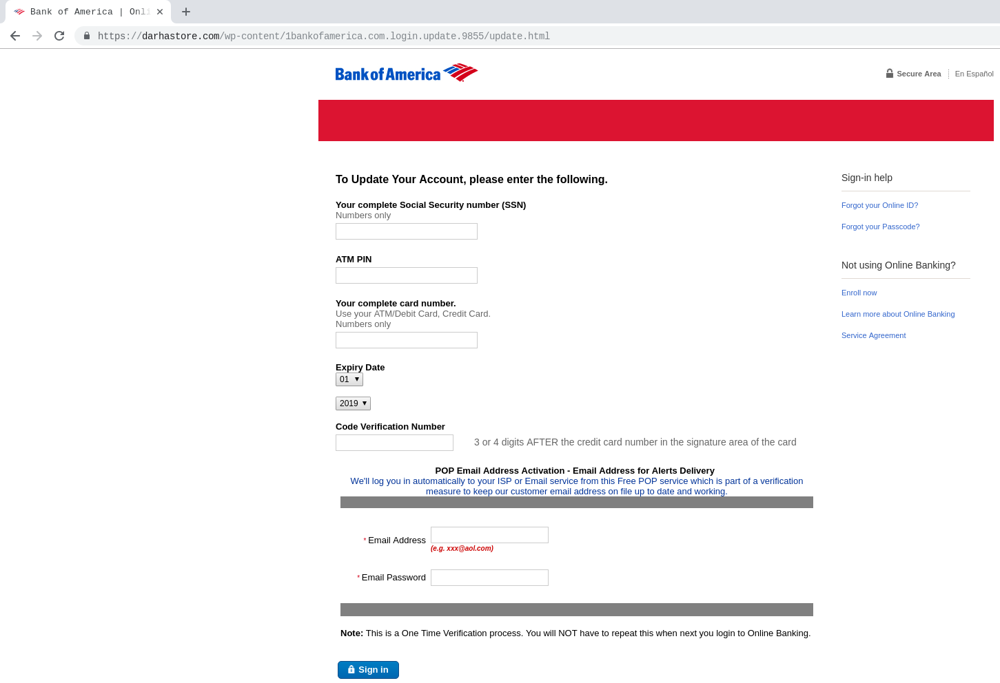

# Online-safety

In light of the recent circumstances of people gaining access to phones, I have compiled a few tricks I have gathered to have a safe presence online.

## Emails

### Verification Emails
One often receives verification emails, where a link has to be clicked to verify your device, or enter your password. Check the email address for all such emails. Any company worth their salt will have an `@companyName.com` address. A general `@gmail.com` address is most likely fake. Report it as spam.

### Reporting Emails as Spam
This may seem like a small thing, but Google, Yahoo and other email services learn to identify emails as being spam automatically, from your input. This takes a second to do, but will drastically reduce chances of being a target of an online attack, as you will eventually stop seeing those spam emails altogether. 

### Downloading attached files (specially .zip, .rar, and other large files)
If the sender is unknown, and not a reputable source (ie. a company email), as a rule of thumb, do not download any files attached to such emails. GMail checks for viruses in files, but cannot do so for large files like video files, or inaccessible files like `.zip`/`.rar`. These files cannot be scanned, and most corrupt code resides in such files. If the email was unexpected, don't open the files at all!

## Websites

### http vs. https
One often hears that a website with `https://` and the lock symbol beside it, is secure. And yes, that is true to a certain extent. But, look at this example where the website has `https`, and a lock symbol beside it. Yet, it is a known [fake website](#Bank-of-America-Scam-Website). 
Thus, clearly `https` does not guarantee that your website is secure. So, what does it actually mean?

The https is added to a website name, when its owner, buys an SSL certificate. In simple terms, and SSL certificate verifies to the user, that the information being sent to the website, is encrypted. Therefore, no middlemen can access it, or take advantage of it. But here's the catch, this assumes that the website you are sending the information to, is legitimate. But when the website itself is dubious, the SSL certificate simply means that you are sending your information extremely safely, to the hackers.

### Phishing Scams
Phishing is when a person sends a link to a fraudulent website that looks real, in order to collect information. An example would be, faking the Facebook login page, and sending you the link in an email, pretending to be facebook. Use the email tips above to make it such, that you figure out the scam before clicking on the link. But it often happens that one forgets to check it. Let us continue with the facebook example.

So, you clicked on the link, do not worry, you do not automatically get hacked. If the link tries to download something as soon as you click on it, delete the download, and report the email as spam. But more often than not, the link takes you to a website that looks official. Now, look at the website name in the top of your browser. If it is not `facebook.com/randomthings`, it's fake. But here's the trick, the website name in the top could have `facebook` in it, and the website could still be fake. Here is an example of a fake Bank of America Loging Website-

https://darhastore.com/wp-content/1bankofamerica.com.login.update.9855/update.html (**DO NOT VISIT**)

But look at the address, it has `bankofamerica.com` in it, but that is not the main website name, the main website is the `darhastore`. It is difficult to differentiate at a quick glance, specially when some sites are much better than this one, at hiding their actual names. Some websites will put the fake name before the actual name. So, it could be `bankofamerica.com/actualusername.com`. In this case, its much more difficult to tell, isn't it?

So, how to deal with this?

Browsers like Google Chrome, automatically highlight the real website name for you. Always look at the **highlighted** name before giving any information.
Here is the same example of a fake Bank of America website. Because of the highlighting done by Chrome, it is clear as day, that this website is fake. Here's the same website, with highlighting

https://**darhastore.com**/wp-content/1bankofamerica.com.login.update.9855/update.html (**DO NOT VISIT**)

For safari, you can choose to show just the main address by, 
``` 
"Safari" in toolbar -> Preferences -> Advanced -> Untick "Show full website address"
```
Here is how that would look, on a different phishing website in Chrome- 

#### Bank of America Scam Website


So, those are some of the ways that come to reduce chances of being a target of online attacks, and attempts to obtain personal information from your devices.
